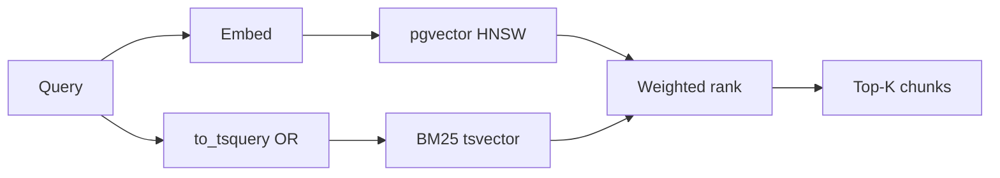
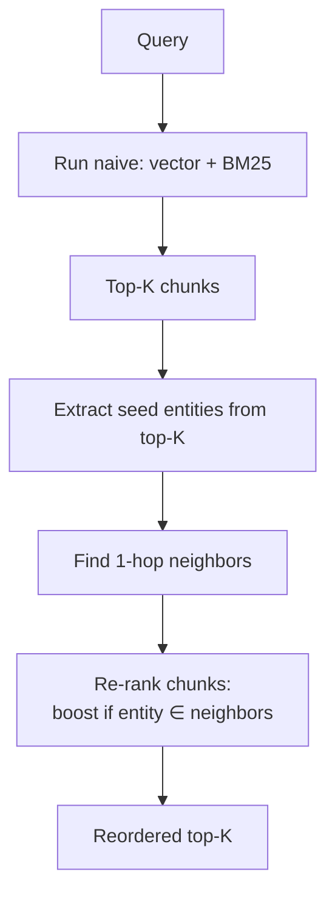
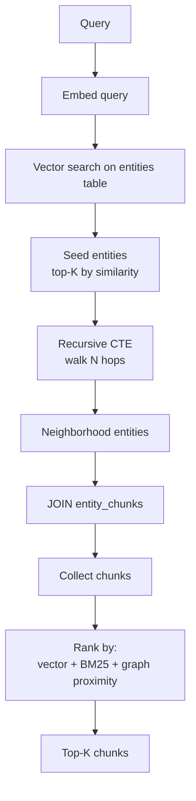
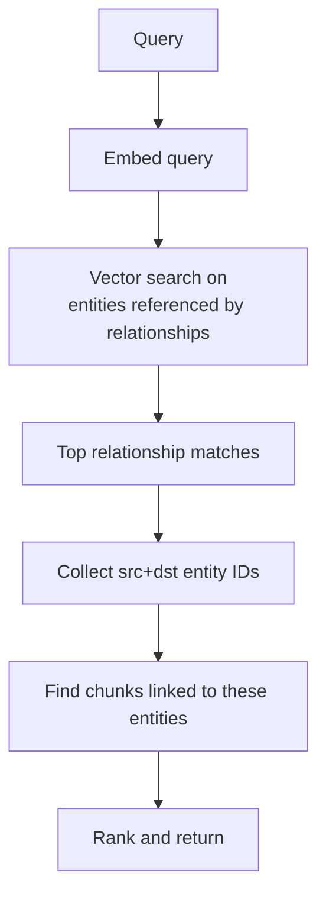
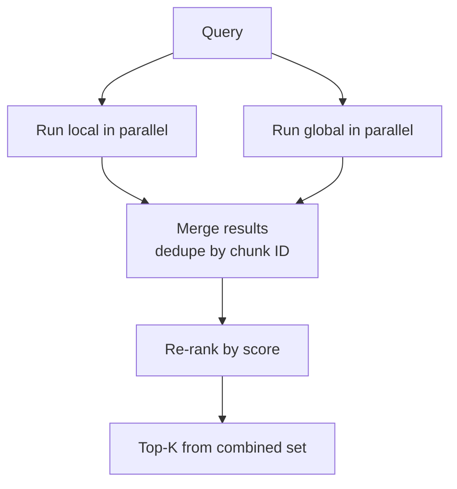
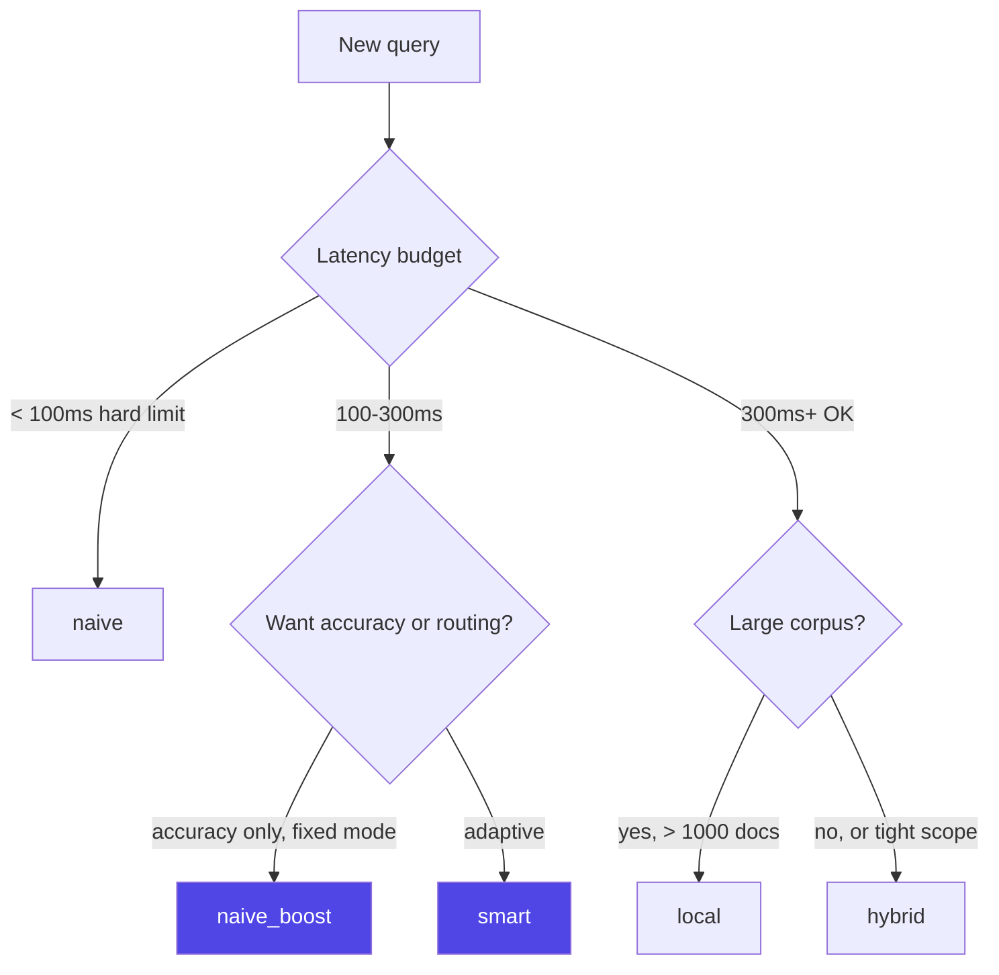

# Retrieval Modes

pg-raggraph has 6 retrieval modes. This guide explains what each one does, when to use it, and shows you the measured trade-offs on real data.

**TL;DR — Just use `smart`.** It picks the right mode per-query automatically. The rest of this document is for when you want to understand, tune, or override it.

---

## The 6 Modes at a Glance

| Mode | Strategy | Best For | Latency | Accuracy on 909-doc corpus |
|------|----------|----------|:-------:|:-------------------------:|
| **`smart`** ⭐ | Confidence routing between naive/boost/local | Default everywhere | 85-220ms | +18.9% vs naive |
| `naive` | Vector + BM25 only | Speed, simple questions | 85ms | baseline |
| `naive_boost` | Naive + 1-hop graph re-rank | Fixed-mode accuracy win | 82ms | **+18.9%** |
| `local` | Seed from vector → expand via recursive CTE | "Pull in new chunks via graph" | 220ms | +1.9% |
| `global` | Search by relationships → find linked chunks | Relationship-centric questions | 150ms | varies |
| `hybrid` | local + global merged | Most exhaustive | 450ms | +1.9% |

**The honest story:** `naive_boost` is the best single-mode choice (+18.9% accuracy at same-or-less latency than naive). `smart` wraps it with confidence routing so fast queries stay fast.

---

## `naive` — Vector + BM25

The baseline. No graph involved.



### What it does
1. Embeds the query with the configured embedding model (default: fastembed BGE-small)
2. Vector cosine similarity search on `chunks.embedding` (HNSW index)
3. BM25 full-text search on `chunks.search_vector` (GIN index) — uses **OR semantics** (`word1 | word2`) for better recall
4. Combined score: `0.7 × vector_sim + 0.3 × bm25_rank`
5. Returns top-K chunks

### SQL
```sql
SELECT c.id, c.content, c.metadata, d.source_path,
       1 - (c.embedding <=> $1::vector) AS vec_score,
       ts_rank(c.search_vector, to_tsquery('english', $5)) AS bm25_score,
       (0.7 * (1 - (c.embedding <=> $1::vector)) +
        0.3 * ts_rank(c.search_vector, to_tsquery('english', $5))) AS score
FROM chunks c
JOIN documents d ON d.id = c.document_id
WHERE d.namespace = $2
ORDER BY score DESC
LIMIT $3
```

### When to use
- **Simple factual questions** — "What is pg_agents built in?"
- **Keyword-heavy queries** — known terms the LLM already embedded
- **Speed matters most** — no graph overhead
- **Starting point** for tuning

### When it fails
- Answer spans multiple documents you need to connect
- Query uses different vocabulary than the documents

```bash
pgrg query "What is pg_agents?" -m naive
```

---

## `naive_boost` — Cheap Graph Re-rank

Runs naive first, then uses the graph to re-rank the top-K. **Our winner in benchmarks.**



### What it does
1. Run `naive` to get top-K candidate chunks
2. Find which entities those chunks contain (seed entities)
3. Find all entities connected to seeds via **1-hop relationships**
4. For each chunk: if it contains a neighbor entity, boost its score by `graph_boost_factor` (default 1.2×)
5. Re-sort and return

Critical: **this does NOT fetch new chunks**. It only re-ranks the ones vector already found. That's what makes it cheap.

### SQL (the graph_boost query)
```sql
WITH seed_entities AS (
    SELECT DISTINCT entity_id FROM entity_chunks WHERE chunk_id = ANY(:chunk_ids)
),
neighbors AS (
    SELECT DISTINCT
        CASE WHEN r.src_id IN (SELECT entity_id FROM seed_entities)
             THEN r.dst_id ELSE r.src_id END AS nid
    FROM relationships r
    WHERE (r.src_id IN (SELECT entity_id FROM seed_entities)
           OR r.dst_id IN (SELECT entity_id FROM seed_entities))
      AND r.namespace = :namespace
)
SELECT c.id, COUNT(DISTINCT ec.entity_id) FILTER (
    WHERE ec.entity_id IN (SELECT nid FROM neighbors)
) AS neighbor_hits
FROM chunks c
LEFT JOIN entity_chunks ec ON ec.chunk_id = c.id
WHERE c.id = ANY(:chunk_ids)
GROUP BY c.id
```

### Why this works so well

Plain vector search finds semantically similar chunks, but can miss chunks that mention **related entities** with different vocabulary. The graph tells us "these chunks talk about things connected to your seed entities, even if they don't match your query words."

On a 909-doc corpus with 60K relationships, this gave:
- **+18.9% top score improvement**
- 6 of 8 queries escalated from medium to high confidence
- Latency essentially unchanged (cache-friendly SQL)

### When to use
- **When you want the accuracy win without thinking about routing**
- **Fixed-mode production endpoints** — deterministic behavior
- **You have >100 interconnected documents**

```bash
pgrg query "How does the agent loop work?" -m naive_boost
```

---

## `smart` — Confidence-Based Routing ⭐ (default)

Runs naive first, then decides what to do next based on the top chunk score.

```mermaid
flowchart TD
    Q[Query] --> N[Run naive]
    N --> C{Top score?}
    C -->|≥ 0.7 <br/>HIGH| F[Return naive as-is<br/>~85ms]
    C -->|0.4 - 0.7 <br/>MEDIUM| B[Apply graph boost<br/>~90ms]
    C -->|< 0.4 <br/>LOW| L[Escalate to local mode<br/>~220ms]
    F --> R[QueryResult<br/>mode: smart[naive]]
    B --> R2[QueryResult<br/>mode: smart[boosted]]
    L --> R3[QueryResult<br/>mode: smart[expanded]]
```

### What it does

Reads `top_score` from the naive result and routes:

- **High confidence** (`top_score ≥ PGRG_BOOST_CONFIDENCE_THRESHOLD`, default 0.7) → Return naive. Fast path.
- **Medium confidence** (between thresholds) → Apply `naive_boost` re-rank. Get the +18.9%.
- **Low confidence** (`top_score < PGRG_EXPAND_CONFIDENCE_THRESHOLD`, default 0.4) → Escalate to `local` mode, pulling in new chunks via graph traversal.

### Why the thresholds?

Validated on real data:
- **Above 0.7** — naive already found the right chunks. Boost doesn't help, just adds latency.
- **0.4-0.7** — naive has candidates but could be re-ordered better. Boost re-ranks, big accuracy win.
- **Below 0.4** — naive doesn't have the right chunks in top-K. Need to pull in new ones via graph.

### When to use
- **Default for everything** — unless you have a specific reason not to
- **Variable workloads** — mix of easy and hard questions
- **Latency-sensitive but accuracy-hungry** — fast path handles 90% of questions, expensive path only when needed

### Inspecting what smart chose
```python
result = await rag.query("question")
print(result.query_mode)  # "smart[naive]" | "smart[boosted]" | "smart[expanded]"
print(result.confidence)  # "high" | "medium" | "low"
print(result.top_score)
```

```bash
pgrg query "question" -m smart  # the default
# Output: --- 10 chunks (91ms) [smart[boosted] confidence=high] ---
```

### Tuning thresholds
```bash
export PGRG_BOOST_CONFIDENCE_THRESHOLD=0.65  # more aggressive boosting
export PGRG_EXPAND_CONFIDENCE_THRESHOLD=0.35 # less aggressive expansion
```

---

## `local` — Graph Expansion from Entity Seeds

Follow entity relationships to find chunks vector search didn't surface.



### What it does

1. Embed the query
2. Vector search on `entities.embedding` to find seed entities (not chunks)
3. Recursive CTE walks the relationship graph up to `max_hops` from seeds (default 2)
4. Collect chunks linked to any entity in the neighborhood via `entity_chunks`
5. Rank the collected chunks by: `0.6 × vector_sim + 0.3 × BM25 + 0.1 × graph proximity`
6. Return top-K

### SQL (simplified)
```sql
WITH RECURSIVE seeds AS (
    SELECT id FROM entities
    WHERE namespace = :ns
    ORDER BY embedding <=> :query_embedding LIMIT :seed_k
),
neighborhood AS (
    SELECT id, 0 AS depth, ARRAY[id] AS path FROM seeds
    UNION ALL
    SELECT e2.id, n.depth + 1, n.path || e2.id
    FROM neighborhood n
    JOIN relationships r ON (r.src_id = n.id OR r.dst_id = n.id)
    JOIN entities e2 ON e2.id = CASE WHEN r.src_id = n.id THEN r.dst_id ELSE r.src_id END
    WHERE n.depth < :max_hops AND NOT (e2.id = ANY(n.path))
)
SELECT c.content, c.metadata,
       (0.6 * (1 - (c.embedding <=> :query_embedding)) +
        0.3 * ts_rank(c.search_vector, to_tsquery('english', :tsquery)) +
        0.1) AS score
FROM chunks c
JOIN entity_chunks ec ON ec.chunk_id = c.id
WHERE ec.entity_id IN (SELECT DISTINCT id FROM neighborhood)
ORDER BY score DESC LIMIT :top_k
```

### When to use
- **Query mentions a specific entity** and you want all related context
- **Explicit graph expansion** — "show me everything connected to X"
- **Pulling in NEW chunks** that don't match the query semantically but are graph-adjacent

### When to avoid
- Top_score is already high (naive found the right stuff) — local will dilute
- Small corpora — there's nothing to "expand" to
- Latency-sensitive paths (it's 4x slower than naive)

```bash
pgrg query "Everything related to the authentication service" -m local
```

---

## `global` — Relationship-Centric Search

Search by relationships, not entities.



### What it does
1. Embed the query
2. Find relationships whose source or target entity is semantically similar to the query
3. Collect all unique entities involved in those top relationships
4. Find chunks linked to those entities
5. Return top-K chunks

### When to use
- **Relationship-focused questions** — "What does X relate to?"
- **You know the answer involves connections, not just concepts**

### When to avoid
- Most of the time — naive_boost and smart cover the same ground faster

```bash
pgrg query "What services depend on the database?" -m global
```

---

## `hybrid` — Local + Global Combined

Runs `local` and `global` in parallel and merges.



### What it does
1. Run `local` mode (entity-centric)
2. Run `global` mode (relationship-centric)
3. Dedupe chunks by ID (keep highest score)
4. Return top-K

### When to use
- **You want both perspectives and don't care about latency**
- **Exploratory queries** where you're not sure what you're looking for
- **Comparison** — "what does EVERY mode return for this?"

### When to avoid
- **In production** — naive_boost is faster AND more accurate on real data
- **Large corpora** — hybrid gets slow (450ms+)

Honest note: **hybrid is not the "most accurate" mode**. On our 909-doc benchmark, hybrid was +1.9% vs naive while naive_boost was +18.9%. Hybrid's reputation as "the safe default" is misleading. Use `smart` or `naive_boost` instead.

```bash
pgrg query "question" -m hybrid  # only when you want to explore
```

---

## Benchmark Summary

Measured on **pg_agents** real-world codebase (909 docs, 23,908 entities, 59,996 relationships) with 20 dev questions:

| Mode | Avg Top Score | p50 Latency | p95 Latency | High confidence count |
|------|:-------------:|:-----------:|:-----------:|:---------------------:|
| `naive` | 0.602 | 109ms | 137ms | 0/20 |
| `naive_boost` | **0.716** | **107ms** | 200ms | **13/20** |
| `smart` | **0.716** | 127ms | 164ms | **13/20** |
| `local` | 0.614 | 423ms | 1079ms | 0/20 |
| `hybrid` | 0.614 | 482ms | 1167ms | 0/20 |

```
vs naive:
  naive_boost    score +18.9%   latency  -1.7% (faster!)
  smart          score +18.9%   latency +16.9%
  local          score  +1.9%   latency +278.1%
  hybrid         score  +1.9%   latency +355.1%
```

### Why smart is +17% latency vs naive_boost being -1.7%

`smart` has some overhead: it has to check confidence, route, and re-record the final mode/latency. On queries that land in "high confidence" it's virtually free, but over 20 queries the median latency is a bit higher because it's serializing more steps. `naive_boost` is simpler — always run naive, always boost, done.

**If you're optimizing for latency and don't need adaptive routing, use `naive_boost`.**
**If you want the best default behavior, use `smart`.**

---

## Choosing a Mode



### Simple rules
- **`smart`** — default. Always works.
- **`naive_boost`** — when you want deterministic behavior + the accuracy win
- **`naive`** — when latency is sacrosanct
- **`local`** — when you explicitly want graph expansion
- **`global`** — rarely (mostly internal use)
- **`hybrid`** — rarely (mostly for exploration)

---

## Configuration Reference

```bash
# Smart mode routing thresholds
export PGRG_BOOST_CONFIDENCE_THRESHOLD=0.7   # ≥ this: ship naive
export PGRG_EXPAND_CONFIDENCE_THRESHOLD=0.4  # < this: escalate to local

# Graph boost
export PGRG_ENABLE_GRAPH_BOOST=true
export PGRG_GRAPH_BOOST_FACTOR=1.2           # multiplier for boosted chunks

# General retrieval
export PGRG_TOP_K=10                          # chunks returned
export PGRG_MAX_HOPS=2                        # max graph traversal depth
export PGRG_SIMILARITY_THRESHOLD=0.3          # min vector similarity
```

---

## Evolution-Aware Retrieval (Tier 1, alpha)

When `evolution_tier="structural"` is set, every mode above gains
metadata-driven filtering and ranking on top of its base behavior:

- **Retraction**: docs with `retracted=true` are penalized or filtered based on
  `retracted_behavior` (`hide` / `flag` / `surface_both`).
- **Supersession**: docs that have been superseded by a newer document (via
  `document_versions.supersedes_document_id`) get a score penalty under
  `supersession_behavior="prefer_new"` or are removed under `"hide"`.
- **Temporal recency**: an exponential boost (`exp(-ln(2) · age_years / half_life)`)
  rewards recent docs. Tunable via `temporal_half_life_years` and `w_recent`.
- **Per-query overrides**:
  - `as_of=datetime(..., tzinfo=...)` filters to docs effective at that timestamp.
  - `version_filter="X"` restricts to docs with `version_label = X`.
  - `evolution_aware=False` forces classic retrieval for a single call.

Evolution scoring composes with the base mode. Score formula when
`evolution_tier="structural"`:

```
score = w_sem · cosine + w_bm25 · ts_rank + w_graph · graph_signal
        + w_recent · temporal_boost
        + w_supersession · supersession_bonus
```

Under `retracted_behavior="hide"` the whole expression is multiplied by
`(NOT retracted)` as defense-in-depth alongside the WHERE filter.

See the [evolution-tracking cookbook](cookbook/evolution-tracking.md) for end-to-end usage.

```bash
# Tier 1 environment variables
export PGRG_EVOLUTION_TIER=structural          # off | structural | fact_aware | full
export PGRG_RETRACTED_BEHAVIOR=flag             # hide | flag | surface_both
export PGRG_SUPERSESSION_BEHAVIOR=surface_both  # hide | prefer_new | surface_both
export PGRG_TEMPORAL_HALF_LIFE_YEARS=5.0
export PGRG_LAMBDA_SUPERSESSION=0.5
export PGRG_W_RECENT=0.10
export PGRG_W_SUPERSESSION=0.10
```
